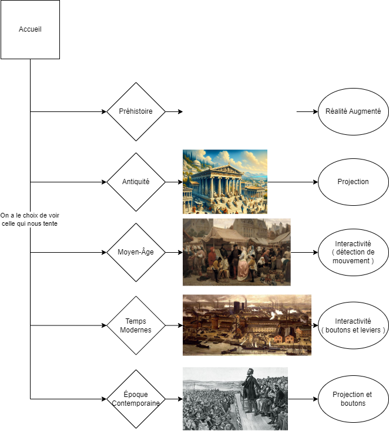
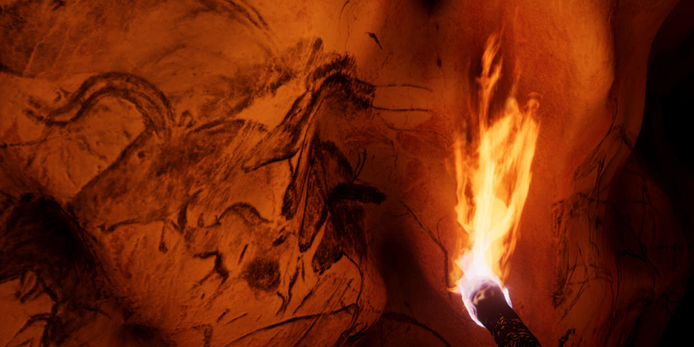
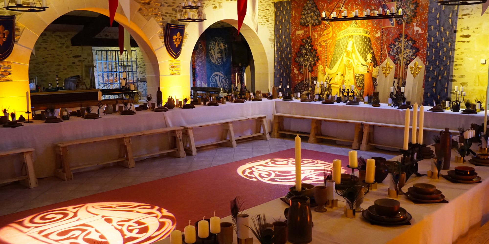
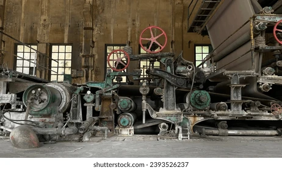
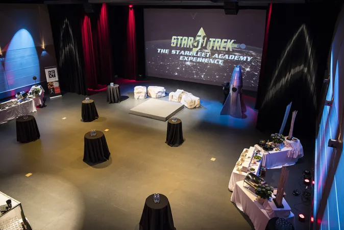

# Scénarisation
## Titre
Les Échos du Temps

## Concept Artistique
"Les Échos du Temps" est une expérience immersive qui combine réalité augmentée (RA), audio 3D, et installations artistiques interactives pour explorer les thèmes de la mémoire, du passage du temps et des récits collectifs. Le projet vise à créer une plateforme où les visiteurs peuvent interagir avec des histoires personnelles et historiques.

## Scénario
Le projet se déroule dans un espace d'exposition conçu comme un labyrinthe temporel. Chaque section du labyrinthe représente une époque ou un événement marquant, allant de l'antiquité à des moments contemporains. Les visiteurs sont invités à suivre un parcours guidé, mais libre, où ils rencontrent des installations interactives qui leur racontent des histoires à travers différents médias.

## Ambiance

## Impact et Objectifs
L'objectif est d'engager le public dans une réflexion sur la manière dont nos histoires personnelles s'entrelacent avec l'histoire collective. Ce projet vise à créer un dialogue intergénérationnel et à encourager la préservation des récits humains à travers les âges.

## Technologies Nécessaires
Réalité augmentée, Audio 3D, Intéractivité, Projection
